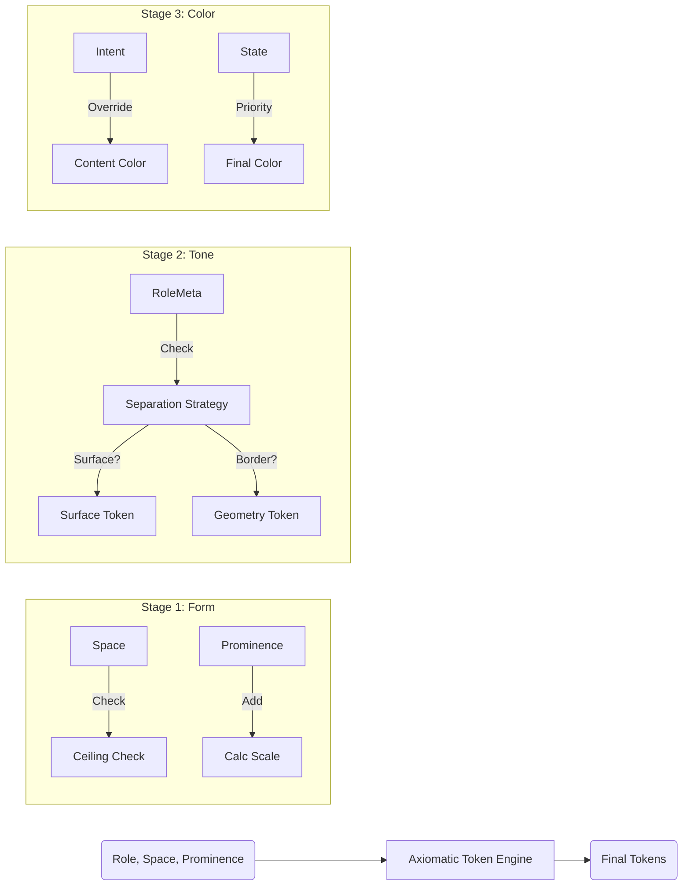

# IDDL 토큰 선택 전략 (Token Selection Strategy)

IDDL (Intent-Driven Design Language) v7.0은 **Axiomatic Token Engine**을 통해 토큰을 결정합니다.  
기존의 휴리스틱(Heuristic) 방식을 대체하여, **5개의 참조 테이블(Reference Tables)**과 **7개의 공리(Axioms)**를 기반으로 결정론적(Deterministic)인 토큰을 생성합니다.

이 문서는 시스템이 어떤 기준으로 크기, 색상, 형태를 결정하는지 설명합니다.

---

## 1. 핵심 철학: Borderless & Context-Aware

새로운 토큰 엔진의 두 가지 핵심 원칙입니다:
1.  **Borderless (경계 없는 디자인)**: 불필요한 선(Border)을 제거하고, **공간(Gap)**과 **면(Surface)**으로 계층을 구분합니다.
2.  **Context-Aware (문맥 인식)**: 같은 컴포넌트라도 **어떤 공간(Space)**에 있느냐에 따라 크기와 밀도가 달라집니다.

---

## 2. 3단계 결의 과정 (3-Stage Resolution)

토큰 엔진은 입력을 받아 3단계 파이프라인을 거쳐 최종 스타일을 도출합니다.

### 1단계: 형태 (Form) - 크기와 간격
- **입력**: `Space`, `Prominence`, `Density`
- **결정 요소**:
    - **Scale (크기)**: 문맥에 따른 텍스트 및 UI 크기 (`scale.sm`, `scale.xl` 등)
    - **Gap (간격)**: 요소 간의 거리 (`space.xs`, `space.md` 등)

### 2단계: 명암 (Tone) - 면과 깊이
- **입력**: `Role Metadata`, `Prominence`
- **결정 요소**:
    - **Surface (배경)**: `None` (투명), `Surface` (배경색), `Elevated` (띄움)
    - **Shadow (그림자)**: 깊이감 표현
    - **Border (선)**: 분리가 꼭 필요한 경우에만 최소한으로 적용

### 3단계: 색채 (Color) - 의미와 상태
- **입력**: `Intent`, `State`
- **결정 요소**:
    - **Content Color**: 텍스트 및 아이콘 색상
    - **Surface Intent**: 구역 자체의 의미론적 색상 (Brand, Error 등)

---

## 3. 공간별 스케일링 전략 (Space Dynamics)

IDDL은 공간을 크게 **Canvas(콘텐츠)**와 **App Tool(도구)**로 구분하여 서로 다른 스케일을 적용합니다.

### A. Canvas Space (`canvas`)
- **목적**: 문서, 다이어그램, 메인 콘텐츠 영역 (Expressive)
- **특징**:
    - 넓은 여백 (Loose Gap)
    - 큰 타이포그래피 (예: `Hero Title` = `text-6xl` ~ `text-8xl`)
    - 깊은 계층 구조 허용

### B. Tool Space (`bar`, `rail`, `panel`, `well`)
- **목적**: 툴바, 사이드바, 속성 패널 (Productivity)
- **특징**:
    - 좁은 여백 (Tight Gap)
    - 컴팩트 타이포그래피 (예: `Hero Title` = `text-lg`)
    - 고밀도 정보 표현

**App Tool Text Matrix 적용 예시:**
| Role | Canvas (Expressive) | Tool (Compact) |
| :--- | :--- | :--- |
| **Title Hero** | `text-6xl` | `text-lg` |
| **Title Strong** | `text-5xl` | `text-base` |
| **Body Standard** | `text-base` | `text-2xs` |

---

## 4. 분리 전략 (Separation Strategy via Metadata)

기존에는 "어떤 컴포넌트가 배경을 가지는지"를 코드 내에 하드코딩했으나, v7.0부터는 **Role Config의 Metadata**로 제어합니다.

### Role Meta 속성: `separation`
각 Role 정의(`role-config.ts`)에 `meta.separation` 속성을 부여하여 분리 방식을 명시합니다.

| 전략 | 설명 | 해당 Role 예시 |
| :--- | :--- | :--- |
| **`gap`** (기본) | 배경/선 없이 오직 **여백**으로만 구분합니다. (투명) | `Stack`, `List`, `Group`, `Inline` |
| **`surface`** | **배경색(Surface)**으로 영역을 구분합니다. 필요시 그림자 동반. | `Card`, `Panel`, `Dialog`, `Toast` |
| **`border`** | **선(Border)**으로 명시적 구분을 둡니다. (예외적 사용) | `Mock`, `Header` (Bottom Border), `Input` |
| **`none`** | 논리적 래퍼일 뿐, 시각적 분리가 없습니다. | `Section`, `Center`, `Container` |

### Axiom: "Padding implies Radius"
테두리 둥글기(`rounded`)는 **Containment(담겨있음)**가 발생할 때만 적용됩니다.
- `separation`이 `surface` 또는 `border`인 경우 → **Radius 적용**
- `separation`이 `gap` 또는 `none`인 경우 → **Radius 없음 (0px)**

---

## 5. 요약: 토큰 엔진 흐름도

